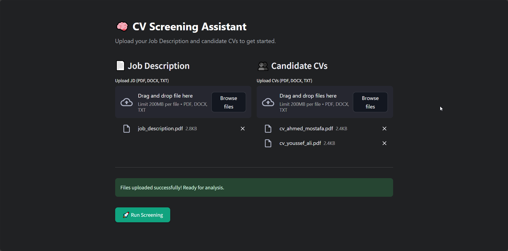
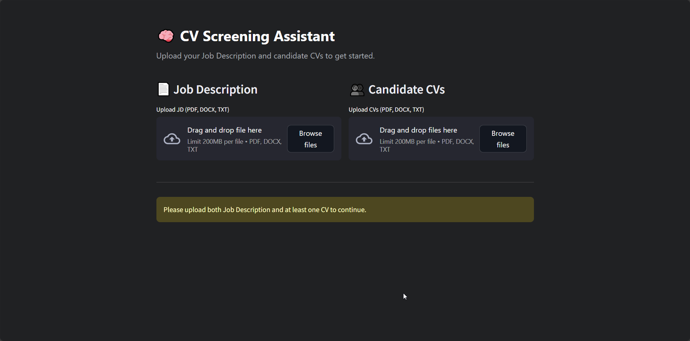

# CVScreeningAgent — AI-Powered CV Screening App

Two-stick intro: 🤖📄

A Streamlit app that parses candidate CVs, analyzes job descriptions, matches skills, and surfaces insights and red flags using Pydantic AI agents and Gemini models.

---

## Badges


---

## Table of Contents

- [Demo](#demo)
- [Features](#features)
- [Installation / Setup](#installation--setup)
- [Usage](#usage)
- [Configuration / Options](#configuration--options)
- [Contributing](#contributing)
- [License](#license)
- [Acknowledgements / Credits](#acknowledgements--credits)

---

## Demo


- Screenshot 1: `./demo/demo.png`
- Screenshot 2: `./demo/demo2.png`
- Walkthrough video: `./demo/demo.mp4`

Images:





Video:

<video src="./demo/demo.mp4" controls width="720"></video>

---

## Features

- **Multi-agent CV analysis** using `pydantic-ai` with structured models in `schemas/`.
- **Gemini model integration** via `pydantic_ai.models.google` and `pydantic_ai.providers.google`.
- **Streamlit UI** with two pages: `ui/introductory_page.py` and `ui/results_page.py`.
- **CV and JD parsing** for PDFs and DOCX via `PyPDF2` and `python-docx` in `services/input_service.py`.
- **Skill matching, candidate insights, red-flag detection** orchestrated by `core/cv_manager.py`.
- **Typed schemas** (`pydantic`) for reliable, validated agent inputs/outputs.

---

## Installation / Setup

Use a virtual environment for isolation.

```bash
# Create a virtual environment
python -m venv .venv

# Activate it
# On Linux/Mac:
source .venv/bin/activate
# On Windows:
.venv\Scripts\activate

# Install dependencies
pip install -r requirements.txt
```

---

## Usage

Run the Streamlit app from the project root:

```bash
streamlit run app.py
```

General flow:

- **Upload CVs/JDs** from the intro page (`ui/introductory_page.py`).
- **Process and analyze** via agents from `agents/agents.py` and orchestrator `core/cv_manager.py`.
- **Review results** on the results page (`ui/results_page.py`): skill matches, insights, and red flags.

---

## Configuration / Options

Main configuration lives in `config.py` (`DefaultCFG`):

- `sleep_time_between_requests: int = 15`
- `api_key: str` — Google AI (Gemini) API key
- `model_name: str = "gemini-2.0-flash"`

Recommendations:

- **Do not hardcode secrets**. Prefer environment variables. For example:
  - Set `GOOGLE_API_KEY` in your environment and use it in `config.py` instead of a literal value.
- Adjust `sleep_time_between_requests` to respect rate limits.
- Confirm `model_name` is available to your account.

Example `config.py` pattern (conceptual):

```python
# config.py (conceptual snippet)
import os
from dataclasses import dataclass

@dataclass
class DefaultCFG:
    sleep_time_between_requests: int = 15
    api_key: str = os.getenv("GOOGLE_API_KEY", "")
    model_name: str = "gemini-2.0-flash"
```

---

## Contributing

- **Issues & PRs** are welcome. Please:
  - Keep changes focused and well-documented.
  - Add or update type hints and docstrings where relevant.
  - Ensure the app runs via `streamlit run app.py` before submitting.

---

## License

This project is licensed under the MIT License. See `LICENSE` for details.

---

## Acknowledgements / Credits

- **Pydantic** and **Pydantic AI** teams for powerful typing and agent frameworks.
- **Streamlit** for rapid UI development.
- **PyPDF2** and **python-docx** for document parsing.
